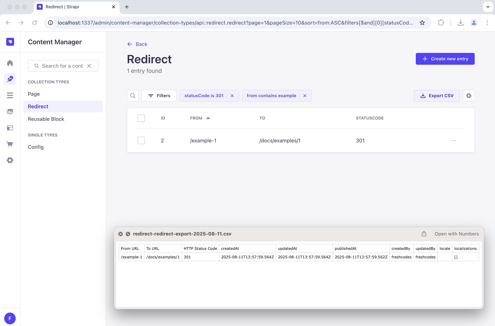

# Export CSV Strapi Plugin

A CSV export plugin for Strapi v5 that adds export functionality to the admin panel with configuration options.



## Installation

```bash
npm install @fresh.codes/strapi-plugin-export-csv
```

## Usage

### Export Filtered Data

1. Go to any content type in the admin panel (e.g., Articles)
2. Apply filters, search, or sort as needed
3. Click the **"Export CSV"** button in the header
4. The CSV will download with your filtered data

### Bulk Export Selected Records

1. Go to any content type list view
2. Select specific records using checkboxes
3. Click **"Export CSV (X selected)"** in the bulk actions menu
4. Only selected records will be exported

## Configuration

### Options

| Option                    | Type                    | Default                                                   | Description                                    |
| ------------------------- | ----------------------- | --------------------------------------------------------- | ---------------------------------------------- |
| `excludedColumns`         | `string[]`              | `['password', 'resetPasswordToken', 'registrationToken']` | Fields to exclude from export                  |
| `maxRecords`              | `number`                | `10000`                                                   | Maximum records to export                      |
| `batchSize`               | `number`                | `100`                                                     | Records per batch (memory management)          |
| `useContentManagerLabels` | `boolean`               | `true`                                                    | Use field labels from admin configuration      |
| `debug`                   | `boolean`               | `false`                                                   | Enable detailed debug logging                  |
| `fieldTransforms`         | `object`                | `{ updatedBy, createdBy }`                                | Functions to transform field values            |
| `headerTransforms`        | `object`                | `{}`                                                      | Custom column header names                     |
| `csvOptions`              | `object`                | CSV Stringify defaults                                    | CSV formatting options                         |
| `populate`                | `string\|array\|object` | `'*'`                                                     | Relations to populate                          |
| `contentTypes`            | `object`                | `{}`                                                      | Override any config for specific content types |

### Example

```javascript
// config/plugins.js
module.exports = {
  'export-csv': {
    enabled: true,
    config: {
      // Global settings (apply to all content types)
      batchSize: 50,

      // Content-type specific overrides
      contentTypes: {
        'api::article.article': {
          batchSize: 10,
          excludedColumns: ['internalNotes'],
        },
      },
    },
  },
}
```

### Field Transforms

Field transforms allow you to modify values before they're written to CSV. The plugin includes several default transforms and supports custom ones.

### Default Field Transforms

The plugin automatically applies these transforms:

```javascript
// These are applied by default - no configuration needed
fieldTransforms: {
  updatedBy: (value) => value?.username ?? '',
  createdBy: (value) => value?.username ?? ''
}
```

### Transform Function Signature

```typescript
type FieldTransform = (
  value: any, // The field value
  record?: any, // The full record object (optional)
  field?: string, // The field name (optional)
) => any // Return the transformed value
```

## CSV Formatting Options

The plugin uses the [csv-stringify](https://csv.js.org/stringify/) library. All options are supported:

```javascript
csvOptions: {
  delimiter: ';',           // Use semicolon instead of comma
  header: true,            // Include headers
  quoted_string: true,     // Quote string values
  escape: '"',             // Escape character
  quote: '"',              // Quote character
  bom: true,              // Add BOM for Excel compatibility

  // Type-based formatting
  cast: {
    boolean: (value) => value ? 'Yes' : 'No'
  }
}
```

## Debug Logging

Enable detailed logging for troubleshooting:

### 1. Enable Strapi debug logging

Add to `config/server.ts`:

```typescript
export default ({ env }) => ({
  // ... other config
  logger: {
    config: {
      level: 'debug', // Required to see debug logs
    },
  },
})
```

### 2. Enable plugin debug

```javascript
// config/plugins.js
module.exports = {
  'export-csv': {
    enabled: true,
    config: {
      debug: true, // Enable for all content types

      // Or enable per content type
      contentTypes: {
        'api::article.article': {
          debug: true, // Only debug article exports
        },
      },
    },
  },
}
```

## License

[ISC License](LICENSE)

Made by [Fresh Codes](https://fresh.codes).
